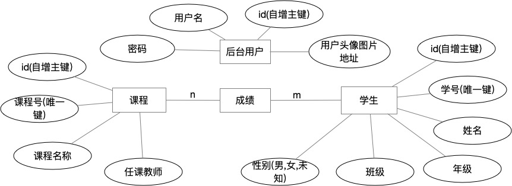
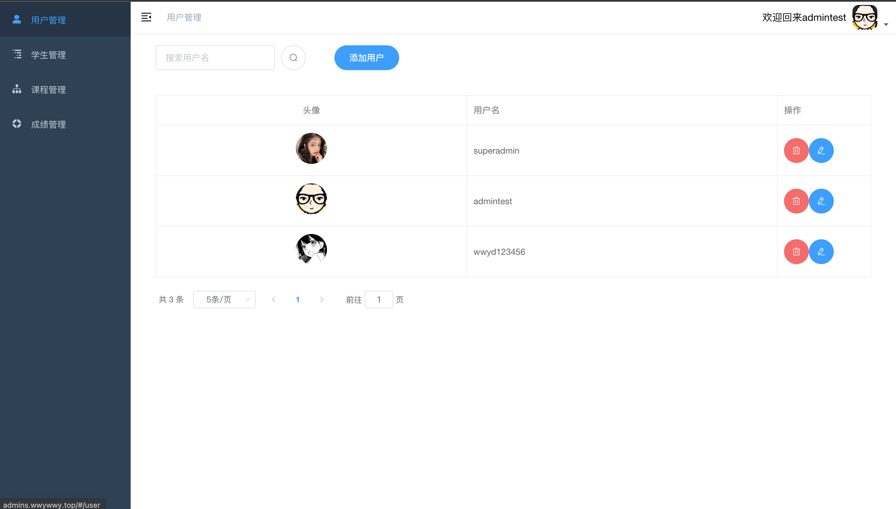
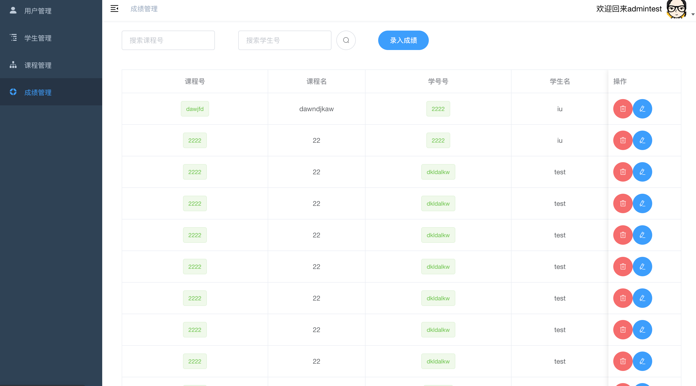

# student-administration-web

#### 介绍
基于nodejs+vue2的学生成绩管理系统

[api文档](https://docs.apipost.cn/preview/83589b6c06410557/ac98ad07a20b77d3)

#### er图

#### 运行说明

1. 导入sql文件
2. 修改后端config.js配置文件
3.  在后端目录下使用`node app.js`运行后端
4. 修改前端的.env.development 和 .env.production 和 .env.staging文件中的api接口地址
5. 在前端目录下使用`yarn run dev`运行前端开发环境，使用`yarn build:prod`编译生产环境
6. 若在开发环境下，可以使用`nodemon app.js`进行热部署，若在生产环境下，可以使用`pm2 start app.js`来守护进程
#### 技术栈

##### 持久化

- [mysql](https://dev.mysql.com/)

##### 后端

- [nodejs](https://nodejs.org/en/)
- [express](https://www.expressjs.com.cn/)

##### 前端

- [vue.js](https://cn.vuejs.org/)
- [element-ui](http://element-cn.eleme.io/)

#### 相关支持

- [腾讯云T-Sec 天御验证码](https://cloud.tencent.com/product/captcha)

#### 图片预览

